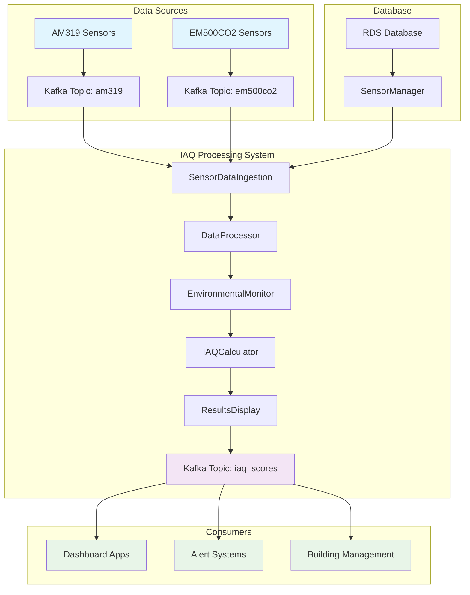
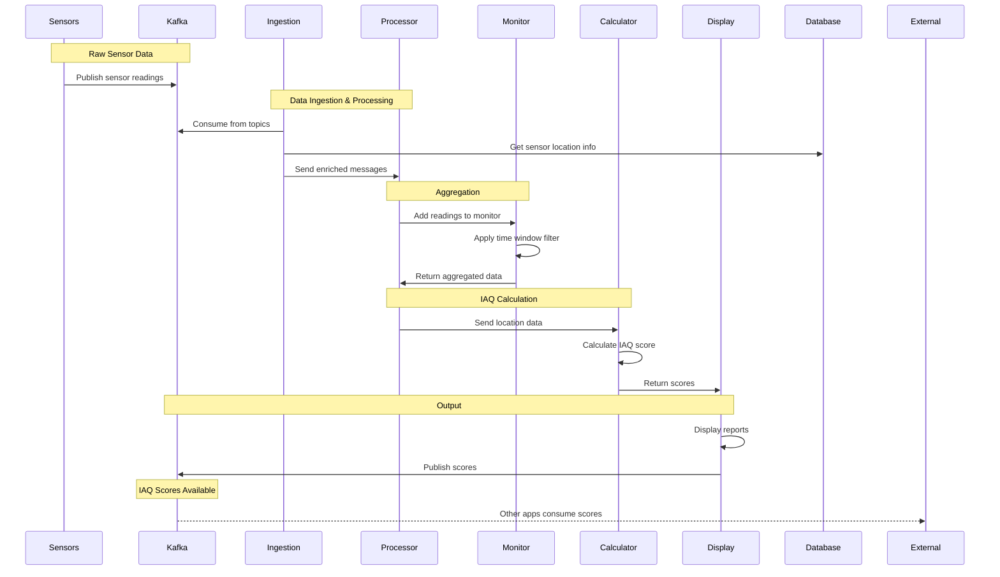

# IAQ (Indoor Air Quality) Processing System

A modular, real-time system for processing IoT sensor data from Apache Kafka and calculating Indoor Air Quality scores using environmental monitoring.

## 🏗️ System Architecture



## 📁 Project Structure

```
src/iaq/
├── app/
│   ├── main.py              # Production IAQ processor (Kafka + RDS)
│   └── test.py              # Local testing with synthetic data
├── data/
│   └── environmentalMonitor.py  # Environmental monitoring classes
├── model/
│   ├── score_calculator.py  # IAQ calculation logic
│   └── space.py            # Space type definitions
├── rds/
│   ├── rdsTable.py         # Database connectivity
│   └── credentials.yaml    # Database credentials
├── clickhouse/
│   └── utils.py            # ClickHouse utilities
└── configs/
    ├── space_types/        # Space-specific configurations
    └── mwaa-public-network.yml
```

## 🧩 Component Architecture

### 1. Configuration & Setup (`IAQConfig`)
- **Purpose**: Centralized configuration management
- **Responsibilities**:
  - Kafka broker settings
  - Database connection parameters
  - Processing intervals and window sizes
  - Supported sensor types

### 2. Database & Sensor Management (`SensorManager`)
- **Purpose**: Manages sensor metadata and location mappings
- **Responsibilities**:
  - Load sensor-to-location mappings from RDS
  - Determine space types from zone names
  - Provide sensor location information
- **Data Flow**: `RDS Database → SensorManager → Location Mappings`

### 3. Kafka Connection Management (`KafkaManager`)
- **Purpose**: Handles all Kafka operations
- **Responsibilities**:
  - Create and manage consumers for sensor topics
  - Publish calculated IAQ scores
  - Handle authentication with AWS MSK
- **Data Flow**: `Kafka Topics ↔ KafkaManager ↔ Application`

### 4. Raw Sensor Data Ingestion (`SensorDataIngestion`)
- **Purpose**: Consumes and preprocesses sensor data
- **Responsibilities**:
  - Multi-threaded consumption from Kafka topics
  - Enrich sensor data with location information
  - Route processed data to aggregation layer
- **Data Flow**: `Kafka → SensorDataIngestion → Enriched Messages`

### 5. Data Processing & Aggregation (`DataProcessor`)
- **Purpose**: Aggregates sensor data using environmental monitors
- **Responsibilities**:
  - Create `EnvironmentalMonitor` instances per location
  - Map raw sensor parameters to standard IAQ parameters
  - Apply time-window filtering and aggregation
- **Data Flow**: `Enriched Messages → EnvironmentalMonitor → Aggregated Data`

### 6. IAQ Score Calculation (`IAQCalculator`)
- **Purpose**: Calculates IAQ scores using processed data
- **Responsibilities**:
  - Map space types to IAQ calculation standards
  - Calculate location-specific IAQ scores
  - Generate score status classifications
- **Data Flow**: `Aggregated Data → IAQ Algorithm → IAQ Scores`

### 7. Results Display & Output (`ResultsDisplay`)
- **Purpose**: Displays results and publishes to Kafka
- **Responsibilities**:
  - Generate comprehensive monitoring reports
  - Identify air quality issues
  - Publish scores back to Kafka for other consumers
- **Data Flow**: `IAQ Scores → Display/Kafka → End Users/Systems`

### 8. Main Application Controller (`IAQProcessor`)
- **Purpose**: Orchestrates all components
- **Responsibilities**:
  - Initialize and coordinate all modules
  - Manage application lifecycle
  - Handle graceful shutdown

## 🔄 Data Flow Diagram



## 🚀 Getting Started

### Prerequisites

1. **AWS Access**: EC2 instance with MSK access
2. **Python 3.7+** with required packages
3. **Database Access**: RDS credentials configured
4. **SSH Configuration**: AWS SSM access

### SSH Setup

Add to your `~/.ssh/config`:
```ssh
Host msk-test-instance
    HostName i-0a58877a0539ae886
    User ec2-user
    ProxyCommand aws ssm start-session --target %h --document-name AWS-StartSSHSession --parameters 'portNumber=%p'
    IdentityFile ~/.ssh/test-kafka.pem
```

### Deployment Steps

1. **Connect to EC2 instance:**
   ```bash
   ssh -v msk-test-instance
   ```

2. **Copy code to instance:**
   ```bash
   scp -r /Users/jiaxuchen/Foxx/cleaning_management/environment/iaq_score msk-test-instance:~/
   ```

3. **Navigate to application directory:**
   ```bash
   cd ~/iaq_score/src/iaq/app
   ```

4. **Run the production system:**
   ```bash
   python3 main.py
   ```

### Local Testing

For local development and testing:

```bash
cd src/iaq/app
python3 test.py
```

This uses synthetic data instead of Kafka/RDS for local development.

## 🎯 Expected Output

### Startup Messages
```
🚀 IAQ Processor initialized
   • Locations: 9
   • Sensor types: 6
   • Supported types: ['am319', 'em500co2']
🔄 Starting IAQ monitoring system...
✅ System running - monitoring sensor data and calculating IAQ scores...
Press Ctrl+C to stop
```

### Monitoring Status (No Data)
```
[19:30:15] Monitoring... (0 messages processed)
```

### Full IAQ Report (With Data)
```
================================================================================
🏢 IAQ MONITORING REPORT - 2025-06-11 19:30:15
================================================================================
📊 SUMMARY:
   • Locations monitored: 9
   • Average building score: 78.3 (Good)
   • Messages processed: 1,247
   • Last data: 19:30:12

🎯 LOCATION SCORES:
Location                            Score    Status       Parameters   Key Issues
--------------------------------------------------------------------------------
🔴 Conference Room A                 65.2   Moderate     6            High CO2
🟡 Office Zone 1                     82.1   Good         8            None
🟢 Reception Area                    91.5   Excellent    5            None
🟠 Meeting Room B                    73.8   Good         7            Temp issue
🟢 Lobby                            89.2   Excellent    6            None
🟡 Office Zone 2                     80.4   Good         8            None
🔴 Storage Room                      58.9   Moderate     4            High PM2.5
🟢 Cafeteria                        88.7   Excellent    7            None
🟡 Corridor A                       81.3   Good         5            None

⚠️  DETAILED ANALYSIS - Conference Room A:
   Space Type: conference → Conference/Meeting Rooms
   Score: 65.2 (Moderate)
   Available Parameters: PM2.5, CO2, Temperature, Humidity, tVOC, PM10
   Time Window: 5 minutes
   Readings in Window: 12
   Data Range: 19:25:15 → 19:30:12
   Current Readings:
      CO2         : 1,250.0 ppm
      PM2.5       :    12.3 μg/m³
      Temperature :    23.1 °C
      Humidity    :    45.2 %RH
      tVOC        :   320.5 μg/m³
      PM10        :    18.7 μg/m³
================================================================================
```

### Shutdown Process
```
^C
🛑 Shutdown requested...
🔄 Shutting down IAQ Processor...
✅ Shutdown complete
```

## 📊 IAQ Score Interpretation

| Score Range | Status | Description | Action Required |
|-------------|--------|-------------|-----------------|
| 90-100 | 🟢 Excellent | Optimal air quality | None |
| 80-89 | 🟡 Good | Acceptable air quality | Monitor |
| 60-79 | 🟠 Moderate | Some concerns | Investigate |
| 40-59 | 🔴 Poor | Action needed | Immediate attention |
| 0-39 | ⚫ Very Poor | Health risk | Urgent action |

## 🔧 Configuration

### Time Window Settings
```python
# In IAQConfig class
self.window_size_minutes = 5          # Data aggregation window
self.processing_interval_seconds = 60  # Report generation frequency
```

### Supported Sensor Types
```python
self.supported_sensor_types = ['am319', 'em500co2']
```

### Space Type Mapping
The system automatically maps zone names to space types:
- **Office**: office, cubicle, desk, work
- **Conference**: conference, meeting, boardroom
- **Restroom**: restroom, bathroom, toilet
- **Circulation**: corridor, hallway, circulation
- **Cafeteria**: cafeteria, dining, kitchen, cafe

## 🔍 Troubleshooting

### Common Issues

1. **No messages received:**
   - Check Kafka topic existence: `kafka-topics.sh --list`
   - Verify AWS credentials and region
   - Ensure consumer group is not stuck

2. **Database connection errors:**
   - Verify `credentials.yaml` configuration
   - Check RDS connectivity from EC2
   - Ensure proper IAM permissions

3. **Authentication failures:**
   - Verify AWS region setting: `AWS_DEFAULT_REGION=us-east-1`
   - Check MSK cluster permissions
   - Ensure EC2 instance has correct IAM role

### Debug Commands

```bash
# Check Kafka topics
kafka-topics.sh --bootstrap-server broker:9098 --command-config client.properties --list

# Test topic consumption
python3 ../../tests/kafka_test_consumer.py

# Check topic information
python3 ../../tests/check_topic_info.py
```

## 🔄 Data Pipeline Integration

### Publishing IAQ Scores

The system publishes calculated scores to the `iaq_scores` Kafka topic. Other applications can consume these scores:

```python
from kafka import KafkaConsumer
import json

consumer = KafkaConsumer(
    'iaq_scores',
    group_id='my-dashboard-app',
    value_deserializer=lambda x: json.loads(x.decode('utf-8')),
    # ... kafka config
)

for message in consumer:
    iaq_data = message.value
    print(f"Location: {iaq_data['zone']}, Score: {iaq_data['score']}")
```

### IAQ Score Message Format

```json
{
  "location_key": "building1_floor2_zone3",
  "score": 75.3,
  "status": "Good",
  "space_type": "office",
  "parameters": {
    "CO2": 850.2,
    "PM2.5": 12.1,
    "Temperature": 22.5,
    "Humidity": 45.2
  },
  "project_id": "headquarters",
  "building_id": "main_building",
  "floor": "2",
  "zone": "Office Zone 3",
  "timestamp": "2025-06-11T19:30:15",
  "publish_timestamp": "2025-06-11T19:30:16"
}
```

## 📈 Performance Considerations

- **Memory Usage**: ~50MB base + ~1MB per location monitored
- **Processing Latency**: < 5 seconds from sensor data to IAQ score
- **Throughput**: Handles 1000+ sensor messages per minute
- **Time Window**: Configurable (default: 5 minutes)

## 🔧 Customization

### Adding New Sensor Types

1. Add to supported types in `IAQConfig`
2. Update parameter mapping in `DataProcessor._map_sensor_parameters()`
3. Ensure Kafka topic exists for the new sensor type

### Modifying Space Types

1. Update `SensorManager._determine_space_type()`
2. Add corresponding space type configuration in `configs/space_types/`
3. Update IAQ calculation parameters if needed

---

*For more detailed information about IAQ calculations and algorithms, see `IAQ.md`.*