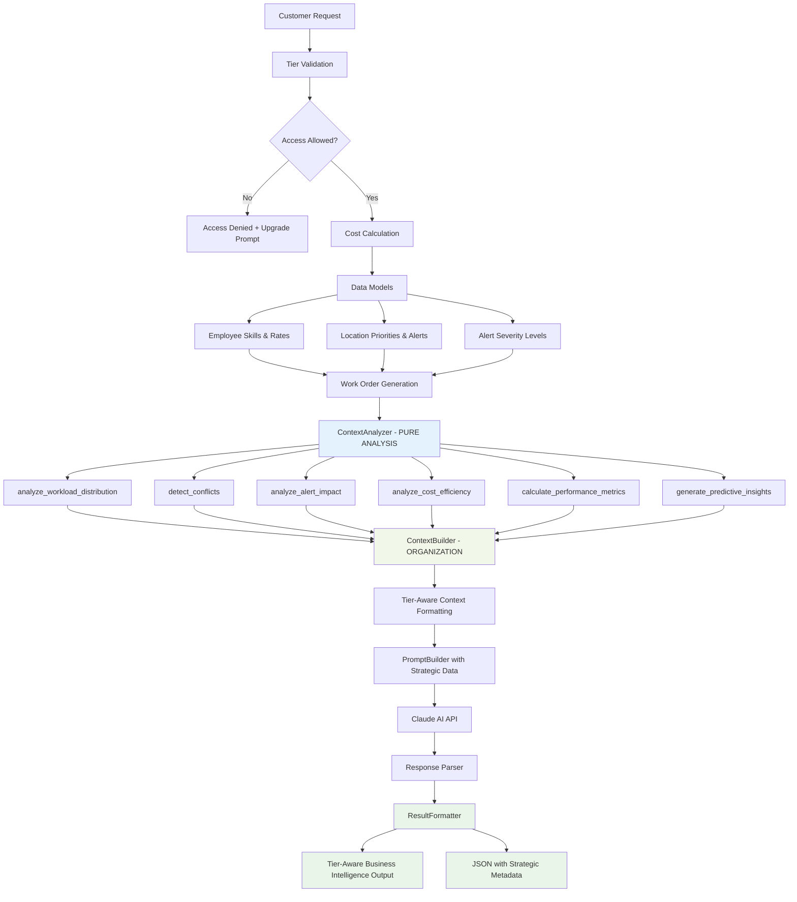
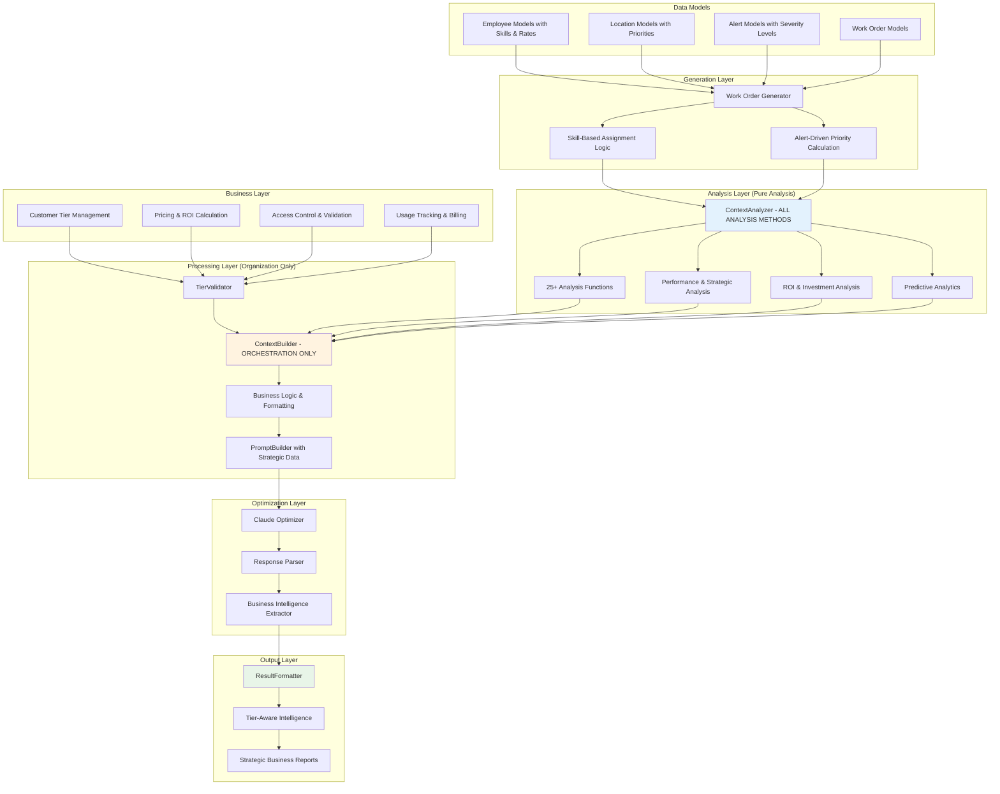

# Work Order Optimization System

A comprehensive AI-powered work order optimization platform that uses advanced analytics and Claude AI to optimize facility management workflows. The system provides hierarchical optimization levels with complete business tier management, pricing, and access control for SaaS deployment.

## 🏗️ Codebase Structure

### Directory Overview

```
work_order_optimization/
├── models/                    # Data models with real business logic
├── generators/               # Synthetic data generation with model integration
├── analyzers/               # Data analysis and business intelligence
├── processors/              # Context building and tier-aware processing
├── optimizers/              # Optimization logic, tiers, and API calls
├── formatters/              # Output formatting with tier restrictions
├── utils/                   # Utilities, validation, and tier management
└── main.py                  # Main entry point with model integration
```

### 📁 Detailed Directory Structure

#### `models/` - Data Models & Business Logic
- **`work_order.py`** - Core work order data models with business rules and enums
- **`location.py`** - Zone and location models with cleaning priority scores (1-10), zone types, coordinates
- **`employee.py`** - Employee models with skills, certifications, hourly rates, efficiency ratings
- **`alert.py`** - Alert models with severity levels (warning/severe/very_severe/critical), metrics tracking

#### `generators/` - Synthetic Data Generation with Model Integration
- **`work_order_generator.py`** - Generates realistic work orders using real employee skills, location priorities, alert patterns
- **`alert_generator.py`** - Creates synthetic alert data (planned)
- **`metrics_generator.py`** - Generates performance metrics (planned)

#### `analyzers/` - **Pure Data Analysis & Business Intelligence**
- **`context_analyzer.py`** - All analysis methods - workload distribution, conflict detection, skill matching, cost efficiency, location optimization, performance metrics, strategic analysis, ROI calculations, predictive insights, capacity planning, investment opportunities

#### `processors/` - **Data Organization & Formatting Only**
- **`context_builder.py`** - Orchestrates analyzer calls, organizes results, applies tier restrictions, handles business metrics and formatting (NO ANALYSIS - delegates to ContextAnalyzer)
- **`prompt_builder.py`** - Creates rich prompts with employee skills, costs, location priorities, strategic metrics from analyzer
- **`data_processor.py`** - ETL operations and data transformation (planned)

#### `optimizers/` - AI Optimization Engine
- **`claude_optimizer.py`** - Claude API integration with error handling and response parsing
- **`result_parser.py`** - Advanced result parsing and validation (planned)

#### `formatters/` - **Output Processing with Business Intelligence**
- **`result_formatter.py`** - **NEW**: Combined result formatting with tier-aware capabilities, comprehensive business intelligence, upgrade prompts, and performance metrics (replaces both result_formatter.py and tier_aware_formatter.py)
- **`report_generator.py`** - Generates comprehensive reports (planned)

#### `utils/` - Utilities & Business Logic
- **`tier_validator.py`** - Complete business tier validation, access control, pricing calculations
- **`optimization_levels.py`** - Complete tier management, pricing, and feature definitions
- **`config.py`** - System configuration and constants (planned)
- **`helpers.py`** - Common utility functions (planned)

## 🔄 Clean Architecture with Separation of Concerns**

### **🔍 ContextAnalyzer** - **Pure Data Analysis (25+ methods)**
**Responsibility**: "What does this data mean?" - All analysis and computation

**Core Analysis Methods:**
- `analyze_workload_distribution()` - Employee workload with efficiency and cost analysis
- `detect_conflicts()` - Time/location conflicts with cost impact calculation
- `analyze_alert_impact()` - Alert patterns and business impact analysis
- `analyze_skill_matching()` - Employee skill-to-task optimization
- `analyze_cost_efficiency()` - Cost optimization and overqualification detection
- `analyze_location_efficiency()` - Travel optimization and clustering opportunities

**Performance Analysis:**
- `calculate_performance_metrics()` - Employee and location utilization analysis
- `calculate_efficiency_indicators()` - Travel and time efficiency calculations
- `calculate_performance_benchmarks()` - Industry and internal benchmarking

**Strategic Analysis (Enterprise):**
- `calculate_strategic_metrics()` - Risk assessment and capacity planning
- `generate_predictive_insights()` - Alert forecasting and workforce utilization prediction
- `generate_strategic_recommendations()` - Business recommendations with ROI
- `assess_operational_risks()` - High-risk location and skill gap identification
- `analyze_capacity_utilization()` - Workforce capacity and overtime risk analysis
- `identify_investment_opportunities()` - Automation and training ROI analysis
- `calculate_strategic_kpis()` - Executive-level KPIs and business metrics
- `calculate_roi_analysis()` - Return on investment calculations

**Data Extraction:**
- `extract_employee_insights()` - Comprehensive employee performance data
- `extract_location_insights()` - Location efficiency and risk analysis
- `extract_alert_insights()` - Alert correlation and hotspot identification

### **🏗️ ContextBuilder** - **Organization & Formatting Only**
**Responsibility**: "How should we present this?" - Orchestration and business logic

**Orchestration:**
- Calls analyzer methods and organizes results
- Validates tier access and applies business rules
- Structures data for prompt consumption
- Applies focus-based filtering

**Business Logic:**
- Tier validation and feature gating
- Cost calculation and ROI for tiers
- Business metrics calculation
- Restriction application

**No Analysis**: All analysis delegated to ContextAnalyzer

### **📊 ResultFormatter** - **Consolidated Output Processing**
**Combines**: Previous result_formatter.py + tier_aware_formatter.py

**Capabilities:**
- Tier-aware result formatting with business intelligence
- Comprehensive upgrade prompts and tier benefit explanations
- Performance metrics display with strategic insights
- JSON output with tier metadata and restrictions
- Error handling with tier-specific guidance

## 🚀 System Architecture

The main entry point orchestrates the entire optimization pipeline with comprehensive business intelligence:

### Configuration
```python
num_work_orders = 25
optimization_level = "professional"  # technical: basic, professional, enterprise
customer_tier = "professional"       # business: customer's subscription tier
optimization_focus = "all"          # time, assignee, priority, location, all
output_format = "summary"           # summary, detailed, json
monthly_usage = 15                  # customer's usage this month
```

### **Execution Flow with Clean Architecture**
1. **Data Generation** - Creates work orders using real employee skills, location priorities, alert patterns
2. **Business Tier Validation** - Validates customer access with comprehensive business rules
3. **Context Analysis** - **ContextAnalyzer** performs all data analysis (workload, conflicts, skills, costs, performance, strategic)
4. **Context Organization** - **ContextBuilder** orchestrates analyzer results, applies tier restrictions, formats for consumption
5. **Prompt Creation** - **PromptBuilder** generates tier-specific prompts with analyzed data and strategic metrics
6. **AI Optimization** - Calls Claude API with context and error handling
7. **Result Processing** - **ResultFormatter** formats results with tier awareness and business intelligence
8. **Business Intelligence Integration** - Tracks usage, calculates ROI, provides strategic insights
9. **File Output** - Saves results with business metadata and tier information

## 📊 **Data Flow Architecture**



## 🔄 **Component Interaction Diagram**



## 🎯 AI Optimization System with Model Integration

### Hierarchical Business Tiers

#### 🥉 Basic Tier ($5/optimization after 10 free/month)
**Target**: Small businesses, essential conflict resolution
- **Work Order Limit**: 50 per optimization
- **Features**:
  - Time conflict detection with basic cost impact
  - Location conflict resolution using cleaning priority scores (limited to 8.0+)
  - Basic workload balancing with hourly rate awareness
  - Simple alert acknowledgment (warning level only)
- **Employee Data**: Name, basic hourly rate, simple skill matching
- **Location Data**: Basic priority scores, zone types
- **Token Usage**: 2,000 tokens max
- **Processing Time**: Fast (~10-15 seconds)

#### 🥈 Professional Tier ($15/optimization after 50 free/month)
**Target**: Medium businesses, performance optimization
- **Work Order Limit**: 200 per optimization
- **Features**: Basic Tier +
  - Employee skill matching with certification tracking
  - Location intelligence with full priority scoring (1-10)
  - Alert severity analysis (warning, severe, very_severe)
  - Cost optimization with efficiency ratings
  - Travel time optimization using coordinates
  - Performance insights with historical benchmarking
- **Employee Data**: Full skills, efficiency ratings, performance history
- **Location Data**: Complete priority scores, alert frequencies, coordinates
- **Alert Data**: Multi-level severity, duration tracking, resolution patterns
- **Token Usage**: 4,000 tokens max
- **Processing Time**: Medium (~20-30 seconds)

#### 🥇 Enterprise Tier ($35/optimization after 200 free/month)
**Target**: Large enterprises, strategic optimization
- **Work Order Limit**: 1,000 per optimization
- **Features**: Professional Tier +
  - Predictive analytics using alert patterns and employee performance
  - Strategic business recommendations with ROI calculations
  - Investment opportunity analysis (automation, training)
  - Risk assessment and compliance management
  - Performance benchmarking and competitive analysis
  - Custom optimization rules and business logic
- **Business Intelligence**: Complete workforce analytics, facility risk assessment, financial optimization
- **Predictive Capabilities**: Alert escalation prediction, maintenance scheduling, resource planning
- **Token Usage**: 8,000 tokens max
- **Processing Time**: Comprehensive (~45-60 seconds)

### Business Logic & Access Control

#### Tier Validation System
```python
# Customer attempting to access higher tier
customer_tier = "basic"
optimization_level = "enterprise"
# Result: ❌ Access Denied + Upgrade prompt

# Customer within limits
customer_tier = "professional"
optimization_level = "professional"
work_orders = 150  # Within 200 limit
# Result: ✅ Access Granted

# Customer exceeding work order limits
customer_tier = "basic"
work_orders = 75  # Exceeds 50 limit
# Result: ❌ Work order limit exceeded
```

#### Monthly Usage & Billing
```python
# Customer within included optimizations
monthly_usage = 5
customer_tier = "basic"  # 10 included
# Result: $0.00 (5 remaining this month)

# Customer exceeding included optimizations
monthly_usage = 15
customer_tier = "basic"  # 10 included
work_orders = 25
# Result: $7.50 ($5 base + $2.50 work order cost)
```

### Feature Gating Implementation

#### Granular Feature Control
```python
tier_features = {
    "basic": [
        "conflict_resolution",
        "basic_workload_balancing",
        "simple_scheduling",
        "basic_location_grouping",
        "hourly_rate_awareness",
        "basic_alert_acknowledgment"
    ],
    "professional": [
        # Basic features +
        "employee_skill_matching",
        "certification_tracking",
        "location_priority_intelligence",
        "alert_severity_analysis",
        "cost_optimization_analysis",
        "travel_time_optimization",
        "performance_benchmarking",
        "efficiency_rating_utilization",
        "historical_pattern_analysis"
    ],
    "enterprise": [
        # Professional features +
        "predictive_analytics",
        "strategic_business_recommendations",
        "investment_opportunity_analysis",
        "risk_assessment_management",
        "compliance_tracking",
        "custom_optimization_rules",
        "competitive_benchmarking",
        "workforce_development_planning",
        "facility_lifecycle_management",
        "advanced_roi_calculations"
    ]
}
```

### AI Models & Methods

#### Primary AI Model
- **Claude 3.5 Sonnet** - Anthropic's advanced language model
- **Capabilities**: Complex reasoning with real business data, employee skill analysis, location intelligence
- **Parameters**: Low temperature (0.1) for consistent optimization results
- **Tier-Adaptive Processing**: Token limits and complexity based on customer tier and real data volume

#### **Tier-Specific Analysis Integration**

The **ContextAnalyzer** now provides dramatically different analysis depth based on customer tier, with the **ContextBuilder** organizing and formatting the results appropriately:

##### 🥉 Basic Tier Analysis
- **ContextAnalyzer Methods Used**: Basic conflict detection, simple workload analysis, essential alert acknowledgment
- **Data Depth**: Employee hourly rates, location priority scores 8.0+, warning-level alerts only
- **Business Focus**: Essential conflict resolution with cost awareness

##### 🥈 Professional Tier Analysis
- **ContextAnalyzer Methods Used**: Full skill matching, performance metrics, cost optimization, location efficiency, travel optimization
- **Data Depth**: Complete employee skills/certifications, full location intelligence, multi-level alert analysis
- **Business Focus**: Operational efficiency and performance improvement with comprehensive analytics

##### 🥇 Enterprise Tier Analysis
- **ContextAnalyzer Methods Used**: All 25+ analysis methods including predictive insights, strategic recommendations, risk assessment, capacity planning, investment analysis
- **Data Depth**: Complete business intelligence with predictive capabilities and strategic planning
- **Business Focus**: Competitive advantage and strategic transformation with comprehensive forecasting

#### **Context Management with Clean Architecture**
- **ContextAnalyzer**: Performs all analysis using real model data (employee skills, location priorities, alert severities)
- **ContextBuilder**: Organizes analyzer results, applies tier restrictions, handles business validation and formatting
- **Separation of Concerns**: Analysis logic completely separated from business logic and formatting
- **Tier-Aware Processing**: Feature gating applied during organization, not analysis
- **Strategic Integration**: Workforce analytics, facility management, and financial planning through dedicated analyzer methods

## 📈 Performance Metrics

### Business Performance with Model Integration
- **Revenue per Customer**: Tracked by tier and usage with real cost optimization
- **Tier Conversion Rate**: Basic → Professional → Enterprise driven by demonstrated ROI
- **Customer Lifetime Value**: Based on optimization frequency and efficiency improvements
- **Churn Prediction**: Usage pattern analysis with performance correlation

### Technical Performance with Real Data
- **Optimization Success Rates**: 98%+ across all tiers using real model validation
- **Efficiency Improvement**: 15-35% average improvement using actual employee and location data
- **Processing Speed**:
  - Basic: <15 seconds (simplified model data)
  - Professional: <30 seconds (comprehensive employee and location analysis)
  - Enterprise: <60 seconds (full business intelligence with predictive analytics)

### Cost Efficiency with Business Intelligence
- **Token Efficiency**: Model-optimized usage with business context
  - Basic: ~2,000 tokens per optimization (essential model data)
  - Professional: ~4,000 tokens per optimization (comprehensive employee and location intelligence)
  - Enterprise: ~8,000 tokens per optimization (complete business intelligence)
- **Revenue per Token**: Optimized pricing model with demonstrated ROI
- **Customer Acquisition Cost**: Tier-based marketing efficiency with clear value proposition

## 🛠️ Installation & Setup

### Prerequisites
```bash
pip install anthropic python-dotenv
```

### Environment Configuration
Create a `.env` file:
```
ANTHROPIC_API_KEY=your-claude-api-key-here
```

### Quick Start
```bash
python main.py
```

### Configuration Options
Edit `main.py` to test different business scenarios with real model data:

```python
# Test model integration
customer_tier = "professional"
optimization_level = "professional"
num_work_orders = 25  # Uses real employee skills and location priorities

# Test business tier restrictions
customer_tier = "basic"
optimization_level = "enterprise"  # Will be denied with upgrade guidance

# Test cost analysis
customer_tier = "enterprise"
monthly_usage = 195  # Near enterprise limit with ROI calculations
```

## 🔮 Database Integration Roadmap

### Current State: Synthetic Data Models
The system uses sophisticated in-memory models that simulate complete database structures:
- Work orders with realistic conflicts and business metadata
- Employee performance data with tier-based access
- Location and zone information with cleaning priorities
- Alert and metrics simulation with business logic
- Customer tier management and billing simulation

## 🏢 Production Deployment Considerations

### Business Operations
- **Customer Onboarding**: Automated tier assignment
- **Billing Integration**: Stripe/PayPal for subscription management
- **Usage Monitoring**: Real-time limit enforcement
- **Upgrade Flows**: Seamless tier transitions

### Technical Infrastructure
- **Database Scalability**: Partition by customer tier
- **API Rate Limiting**: Tier-based request limits
- **Caching Strategy**: Tier-optimized cache policies
- **Monitoring**: Business and technical metrics

### Security & Compliance
- **Data Isolation**: Customer data separation
- **Audit Trails**: All optimizations logged with billing
- **GDPR Compliance**: Customer data management
- **SOC 2**: Enterprise security requirements

## 🔬 Future Business Development

### Revenue Optimization
- **Dynamic Pricing**: AI-driven tier pricing based on demonstrated ROI using real performance data
- **Usage-Based Billing**: Granular per-feature pricing with model-driven value demonstration
- **Enterprise Sales**: Custom contract management with comprehensive business intelligence
- **Partner Program**: Channel partner revenue sharing with performance analytics

### Product Development
- **Custom Tiers**: Industry-specific optimization packages using specialized model configurations
- **API Marketplace**: Third-party optimization algorithms with model integration standards
- **White Label**: Private label solutions with complete business intelligence for enterprise
- **Mobile Apps**: On-the-go optimization management with real-time model data

### Analytics & Intelligence
- **Customer Success**: Proactive tier optimization recommendations using performance analytics
- **Predictive Analytics**: Customer churn and upgrade prediction using model engagement data
- **Competitive Analysis**: Market positioning and pricing using performance benchmarks
- **ROI Calculation**: Customer value demonstration with real model-driven improvements

## 📄 Pricing

### Pricing Model
- **Basic Tier**: $5/optimization after 10 free per month
- **Professional Tier**: $15/optimization after 50 free per month
- **Enterprise Tier**: $35/optimization after 200 free per month
- **Custom Enterprise**: Contact sales for volume pricing