# Alert Service

A high-performance, scalable alert generation system designed for processing large volumes of sensor/score data using advanced threshold-based detection with comprehensive optimization techniques.

## 🏗️ System Architecture


## 📁 Project Structure

```
alert/
├── run.py                          # Main entry point for local development
├── README.md                       # This documentation
└── src/
    └── alert/
        ├── app/
        │   ├── app.py              # Core optimized alert application
        │   └── alert_pipeline.py  # Individual alert processing pipeline
        ├── generator/
        │   └── alert_generator.py  # Alert detection and generation logic
        ├── clickhouse/
        │   └── clickhouse_manager.py # ClickHouse database management
        ├── config/
        │   ├── config.yaml         # Main application configuration
        │   ├── rds/
        │   │   └── credentials.yaml # RDS database credentials
        │   └── clickhouse/
        │       └── credentials.yaml # ClickHouse credentials
        ├── data_source/
        │   ├── base_data_source.py     # Abstract data source interface
        │   ├── data_source_factory.py  # Factory for creating data sources
        │   ├── score_data_source.py    # Score-based data source
        │   └── sensor_data_source.py   # Sensor data source
        └── rds/
            └── rds_manager.py      # RDS database management
```

## 🚀 Core Optimization Features

The `AlertApp` class implements several key optimization strategies to handle large-scale alert processing workloads efficiently:

### 1. **Batch Processing** 📦

Instead of processing alert targets one-by-one, the system groups them into configurable batches:

```python
# Configuration
self.batch_size = config.get('optimization', {}).get('batch_size', 50)

# Implementation
target_batches = self._create_target_batches(targets)
for batch in target_batches:
    batch_results = self._process_batch(batch)
```

**Benefits:**
- ✅ Reduces database connection overhead
- ✅ Better resource utilization
- ✅ Improved error isolation (one failed target doesn't stop the batch)

### 2. **Parallel Execution** ⚡

The system supports both threading and multiprocessing based on workload characteristics:

#### Threading (I/O-Bound Tasks)
```python
with concurrent.futures.ThreadPoolExecutor(max_workers=self.max_workers) as executor:
    future_to_target = {
        executor.submit(self._process_single_target, target_config): target_config
        for target_config in batch
    }
```

#### Multiprocessing (CPU-Bound Tasks)
```python
with Pool(processes=self.max_workers) as pool:
    results = pool.starmap(process_target_standalone, process_args)
```

**When to Use Each:**
- **Threading**: Good for I/O-heavy operations (database queries, data fetching)
- **Multiprocessing**: Ideal for CPU-intensive alert calculations and statistical analysis

### 3. **Intelligent Resource Management** 🧠

#### Database Connection Optimization
```python
# Thread-safe: Each thread gets its own ClickHouse connection
ch_manager = ClickHouseManager(self.config['database']['clickhouse']['config_dir'])
alerts, next_timestamp = pipeline.run(ch_manager)
ch_manager.close()
```

#### Worker Pool Sizing
```python
self.max_workers = config.get('optimization', {}).get('max_workers', min(8, cpu_count()))
```
- Automatically adapts to available CPU cores
- Prevents resource over-subscription
- Configurable for different environments

### 4. **Batch Database Operations** 💾

Instead of saving results individually, the system accumulates all results and saves them in optimized batches:

```python
def _batch_save_results(self, alert_results: List[Dict], next_timestamps: Dict):
    """Save all results in batches to improve database performance."""
    chunk_size = 1000
    for i in range(0, len(alert_results), chunk_size):
        chunk = alert_results[i:i + chunk_size]
        self.rds_manager.save_alert_results(alert_table_name, chunk, primary_keys)
```

**Benefits:**
- ✅ Dramatically reduces database transaction overhead
- ✅ Better database performance through bulk operations
- ✅ Improved reliability with chunked saves

### 5. **Smart Timestamp Management** 🕐

The system tracks where to resume processing for each sensor to avoid reprocessing data:

```python
# Find next monitoring start point to avoid duplicate processing
next_start_time = alert_generator.find_next_start_point(raw_violations, violations, alarms)

# Update database with next timestamp
self.rds_manager.update_alert_start_timestamp(sensor_id, data_type, next_timestamp)
```

**Features:**
- Resumes from last processed timestamp
- Avoids reprocessing historical data
- Handles overlapping time windows intelligently
- Maintains state across multiple runs

### 6. **Comprehensive Error Handling** 🛡️

```python
try:
    alerts, next_timestamp = future.result(timeout=300)  # 5 minute timeout
    # Process successful result
except concurrent.futures.TimeoutError:
    logger.error(f"Timeout processing target: {target_config}")
except Exception as e:
    logger.error(f"Error processing target {target_config}: {e}")
    # Continue with other targets
```

**Features:**
- Individual target failures don't stop batch processing
- Configurable timeouts prevent hanging tasks
- Detailed error logging for debugging
- Graceful degradation under failure conditions

## ⚙️ Configuration

### Main Configuration (`config.yaml`)

```yaml
# Database connections
database:
  rds:
    config_dir: "alert/config/rds/credentials.yaml"
  clickhouse:
    config_dir: "alert/config/clickhouse/credentials.yaml"

# Performance optimization settings
optimization:
  batch_size: 50                    # Targets processed per batch
  max_workers: 8                    # Parallel worker threads/processes
  use_multiprocessing: false        # true for CPU-bound, false for I/O-bound
  batch_db_operations: true         # Enable batch database saves

# Logging configuration
logging:
  level: "INFO"
  format: "%(asctime)s - %(name)s - %(levelname)s - %(message)s"
```

### Optimization Parameters Explained

| Parameter | Description | Recommended Values |
|-----------|-------------|-------------------|
| `batch_size` | Number of targets processed per batch | 20-100 (depending on alert complexity) |
| `max_workers` | Parallel worker count | `min(8, cpu_count())` for threading<br>`cpu_count()` for multiprocessing |
| `use_multiprocessing` | Process type selection | `false` for I/O-heavy<br>`true` for CPU-heavy calculations |
| `batch_db_operations` | Enable batch database saves | `true` (recommended) |

## 🔄 Data Flow


## 🎯 Alert Generation Process

### **Violation Detection Algorithm**

```mermaid
flowchart TD
    A[Load Sensor Data] --> B[Apply Thresholds]
    B --> C{Values Outside<br/>Thresholds?}
    C -->|No| D[No Violations]
    C -->|Yes| E[Group Continuous Violations]
    E --> F[Check Duration Requirements]
    F --> G{Duration ≥<br/>Minimum?}
    G -->|No| H[Filter Out Short Violations]
    G -->|Yes| I[Segment Long Violations]
    I --> J[Calculate Violation Statistics]
    J --> K[Check Frequency Requirements]
    K --> L{Frequency ≥<br/>Threshold?}
    L -->|No| M[No Alarms]
    L -->|Yes| N[Generate Alarms]
    N --> O[Calculate Severity]
    O --> P[Create Final Alerts]

    style A fill:#e1f5fe
    style P fill:#e8f5e8
    style C fill:#fff3e0
    style G fill:#fff3e0
    style L fill:#fff3e0
```



### **Alert Parameters**

Each alert target is configured with:

- **Thresholds**: Lower and upper bounds for violations
- **Duration**: Minimum time a violation must persist
- **Frequency**: Number of violations required within time window
- **Time Window**: Period to evaluate violation frequency
- **Severity Calculation**: Based on statistical percentiles

### **Example Alert Configuration**

```python
# From database (mnt_sensor_alarm_setting table)
{
    "sensor_id": "sensor_123",
    "data_type": "temperature",
    "lower_threshold": 18.0,      # Below 18°C triggers violation
    "upper_threshold": 26.0,      # Above 26°C triggers violation
    "duration": 5,                # Violation must last 5 minutes
    "duration_unit": "m",         # Minutes
    "frequency": 3,               # 3 violations needed
    "time_window": 60,            # Within 60 minutes
    "time_window_unit": "m"       # Minutes
}
```

## 🚀 Getting Started

### Prerequisites

- Python 3.7+
- Access to RDS and ClickHouse databases
- Required Python packages (see requirements)

### Local Development Setup

1. **Configure credentials:**
   ```bash
   # Update database credentials
   src/alert/config/rds/credentials.yaml
   src/alert/config/clickhouse/credentials.yaml
   ```

2. **Adjust configuration:**
   ```bash
   # Edit optimization settings
   src/alert/config/config.yaml
   ```

3. **Run the application:**
   ```bash
   python3 run.py
   ```

### Environment Path Handling

The application automatically handles different path structures:

**Local Development:**
```
alert/src/alert/config/config.yaml  # ✅ Handled automatically
```

**Production/Airflow:**
```
alert/config/config.yaml  # ✅ Config paths adjusted dynamically
```

## 📊 Performance Characteristics

### Optimization Impact

| Metric | Without Optimization | With Optimization | Improvement |
|--------|---------------------|-------------------|-------------|
| **Database Connections** | N targets × 2 connections | ~N/50 × 2 connections | **50x reduction** |
| **Processing Time** | Sequential execution | 8-way parallel | **~8x faster** |
| **Memory Usage** | Unpredictable spikes | Controlled batching | **Predictable** |
| **Error Recovery** | Single failure stops all | Isolated batch failures | **More resilient** |
| **Database Performance** | Individual INSERTs | Bulk operations | **10-100x faster** |
| **Timestamp Management** | Reprocesses all data | Smart resume points | **Eliminates duplicates** |

### Scalability Testing

The system has been tested with:
- ✅ **1,000+ sensors** processed in under 1 hour
- ✅ **50-sensor batches** optimal for most workloads
- ✅ **8-worker threading** provides good I/O parallelism
- ✅ **Smart timestamping** prevents data reprocessing

## 🔧 Optimization Tuning Guide

### For I/O-Heavy Workloads (Database-intensive)
```yaml
optimization:
  batch_size: 30
  max_workers: 12  # Can exceed CPU count for I/O
  use_multiprocessing: false
  batch_db_operations: true
```

### For CPU-Heavy Workloads (Complex Alert Calculations)
```yaml
optimization:
  batch_size: 20
  max_workers: 8   # Match CPU cores
  use_multiprocessing: true
  batch_db_operations: true
```

### For Memory-Constrained Environments
```yaml
optimization:
  batch_size: 10   # Smaller batches
  max_workers: 4   # Fewer workers
  use_multiprocessing: false
  batch_db_operations: true
```

## 🔍 Alert Types and Severity

### **Alert Types**
- **Low**: Values below lower threshold
- **High**: Values above upper threshold
- **Mixed**: Values crossing both thresholds

### **Severity Levels**
- **Low**: Within normal operational range
- **Medium**: Outside 25th-75th percentile range
- **High**: Outside 10th-90th percentile range or industry standards

### **Sample Alert Output**
```json
{
  "start_timestamp": "2025-06-11T14:30:00",
  "end_timestamp": "2025-06-11T14:45:00",
  "sensor_id": "sensor_123",
  "data_type": "temperature",
  "alarm_type": "high",
  "severity": "medium",
  "max_deviation_from_normal": 3.2,
  "min_deviation_from_normal": 1.8,
  "min_duration": 5.0,
  "max_duration": 8.0,
  "avg_duration": 6.5,
  "frequency": 3,
  "status": 0
}
```

## 🐛 Troubleshooting

### Common Issues

1. **No alerts generated:**
   - Check if sensors have `open_alarm = 1` in `mnt_sensor_function_setting`
   - Verify thresholds are appropriate for data ranges
   - Ensure sufficient historical data exists

2. **Memory errors with large batches:**
   - Reduce `batch_size` to 10-20
   - Consider using `use_multiprocessing: true`

3. **Database connection timeouts:**
   - Verify database credentials
   - Check network connectivity
   - Reduce `max_workers` to limit concurrent connections

4. **Slow performance:**
   - Enable `use_multiprocessing: true` for CPU-bound calculations
   - Increase `batch_size` for better throughput
   - Ensure `batch_db_operations: true`

### Performance Monitoring

Monitor these metrics to optimize performance:
- **Batch processing time**: Should be consistent across batches
- **Worker utilization**: All workers should be active during processing
- **Database save time**: Batch saves should be significantly faster than individual saves
- **Memory usage**: Should remain stable throughout processing
- **Alert generation rate**: Track alerts per sensor per time period

## 🎯 Best Practices

1. **Start with default settings** and adjust based on your specific workload
2. **Monitor resource usage** during initial runs to optimize worker counts
3. **Use threading for I/O-heavy** alert processing pipelines
4. **Use multiprocessing for CPU-intensive** statistical calculations
5. **Enable batch database operations** for better performance
6. **Set appropriate timeouts** to prevent hanging tasks
7. **Test with smaller batches** first, then scale up
8. **Monitor alert patterns** to tune thresholds and parameters
9. **Set up regular timestamp cleanup** to maintain optimal performance
10. **Use proper error handling** to ensure system reliability

## 📈 Integration 

### Database Tables Used

- **`mnt_sensor_alarm_setting`**: Alert configuration and next processing timestamps
- **`mnt_sensor_function_setting`**: Feature toggles (open_alarm flag)
- **`pro_sensor_info`**: Sensor metadata and types
- **`mnt_sensor_alarm`**: Generated alert results
- **`sensor_data.*`**: Raw sensor data in ClickHouse
