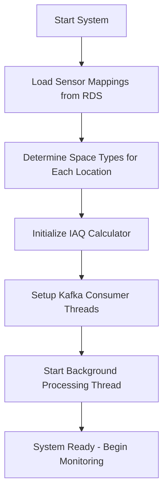
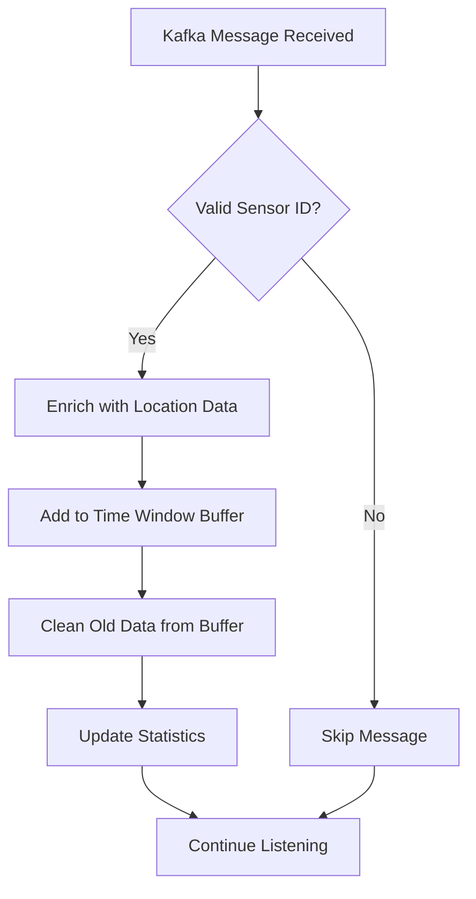
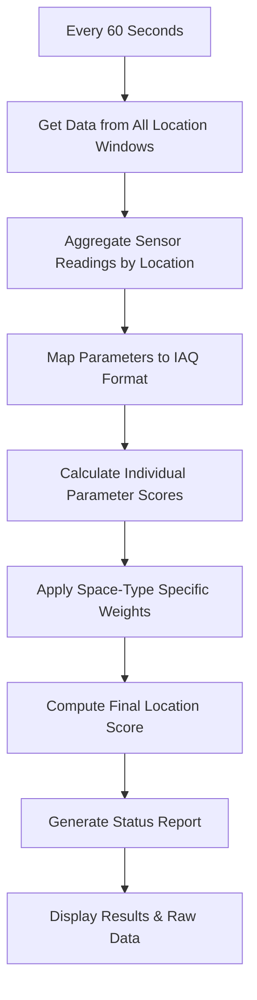

# Real-Time IAQ Monitoring & Scoring System

A comprehensive Indoor Air Quality (IAQ) monitoring system that consumes sensor data from Apache Kafka, calculates real-time air quality scores, and provides actionable insights for building management.

## 🏗️ System Architecture

```
┌─────────────────┐    ┌──────────────────┐    ┌─────────────────────┐
│   IoT Sensors   │───▶│   Apache Kafka   │───▶│  IAQ Processor      │
│  (AM319, etc.)  │    │   (AWS MSK)      │    │  (This System)      │
└─────────────────┘    └──────────────────┘    └─────────────────────┘
                                                          │
                                                          ▼
┌─────────────────┐    ┌──────────────────┐    ┌─────────────────────┐
│   Score Output  │◀───│  IAQ Calculator  │◀───│   RDS Database      │
│  & Monitoring   │    │   (Scoring)      │    │ (Sensor Mapping)    │
└─────────────────┘    └──────────────────┘    └─────────────────────┘
```

## 🔄 Process Flow

### Phase 1: System Initialization



**Steps:**
1. **Database Connection**: Connect to RDS and load sensor location mappings
2. **Space Type Detection**: Automatically categorize zones (Office, Conference Room, etc.)
3. **Kafka Setup**: Establish secure connections to AWS MSK with IAM authentication
4. **Thread Creation**: Spawn consumer threads for each sensor type
5. **Background Processing**: Start periodic scoring and reporting

---

### Phase 2: Real-Time Data Processing



**Data Flow:**
1. **Message Consumption**: Kafka consumers receive JSON sensor data
2. **Sensor Validation**: Check if sensor ID exists in our location mapping
3. **Data Enrichment**: Add location context (project, building, floor, zone)
4. **Window Management**: Store in 5-minute sliding time windows per location
5. **Statistics Tracking**: Update message counts and last activity time

---

### Phase 3: Periodic Score Calculation



**Scoring Process:**
1. **Data Aggregation**: Average sensor readings across the 5-minute window
2. **Parameter Mapping**: Convert sensor parameters (e.g., `co2` → `CO2`)
3. **Individual Scoring**: Score each parameter (PM2.5, CO2, Temperature, etc.)
4. **Weighted Calculation**: Apply space-type specific weights to parameters
5. **Final Score**: Combine weighted scores into overall location score (0-100)

---

## 📊 Data Structures

### Sensor Message Format
```json
{
  "devEUI": "A84041B65183AE99",
  "temperature": 23.4,
  "humidity": 45.2,
  "co2": 680,
  "pm25": 12.3,
  "timestamp": "2025-06-03T23:15:28Z"
}
```

### Enriched Data Structure
```json
{
  "sensor_id": "A84041B65183AE99",
  "location_key": "foxx_office_building1_floor2_conference1",
  "project_id": "foxx_office",
  "building_id": "building1",
  "floor": "floor2",
  "zone": "conference1",
  "sensor_type": "am319",
  "processing_time": "2025-06-03T23:15:28",
  "temperature": 23.4,
  "humidity": 45.2,
  "co2": 680,
  "pm25": 12.3
}
```

---

## 🎯 IAQ Scoring System

### Score Categories
- **90-100**: 🟢 Excellent (No action needed)
- **80-89**: 🟡 Good (Routine maintenance)
- **60-79**: 🟠 Moderate (Monitor closely)
- **40-59**: 🔴 Poor (Requires attention)
- **Below 40**: ⚫ Very Poor (Immediate action required)

### Space-Specific Weightings

| Parameter | Office | Conference | Restroom | Circulation |
|-----------|--------|------------|----------|-------------|
| PM2.5     | 15%    | 15%        | 5%       | 20%         |
| CO2       | 25%    | 30%        | 10%      | 10%         |
| Temperature| 15%   | 15%        | 10%      | 15%         |
| Humidity  | 10%    | 10%        | 15%      | 10%         |
| tVOC      | 15%    | 15%        | 15%      | 15%         |

---

## 🚀 Running the System

### Prerequisites
```bash
# Install dependencies
pip3 install kafka-python pandas

# Ensure IAQ scoring modules are available
export PYTHONPATH="/path/to/iaq_score/src:$PYTHONPATH"
```

### Configuration
```python
# Update these in the main script
bootstrap_servers = [
    'b-1.msk-cluster.kafka.us-east-1.amazonaws.com:9098',
    'b-2.msk-cluster.kafka.us-east-1.amazonaws.com:9098'
]
DATABASE_NAME = "your-database"
CREDENTIALS_FILE = "credentials.yaml"
```

### Execution
```bash
python3 kafka_processor.py
```

---

## 📈 Sample Output

### System Startup
```
🚀 IAQ Processor initialized - monitoring 9 locations with 6 sensor types
🔄 Starting IAQ monitoring system...
✅ System running - monitoring sensor data and calculating IAQ scores...
Press Ctrl+C to stop
```

### Real-Time Processing
```
🔍 Processing am319 message: {'devEUI': 'A84041B65183AE99', 'temperature': 23.4, 'humidity': 45.2, 'co2': 680}
```

### Periodic Report
```
🏢 IAQ MONITORING REPORT - 2025-06-03 23:15:30
================================================================================
📊 SUMMARY:
   • Locations monitored: 3
   • Average building score: 67.2 (Moderate)
   • Messages processed: 47
   • Last data: 23:15:28

🎯 LOCATION SCORES:
Location                            Score    Status       Sensors  Key Issues
--------------------------------------------------------------------------------
🔴 Conference Room 1                 45.2     Poor         2        High CO2, High PM2.5
🟠 Office Zone A                     72.1     Moderate     3        Temp issue
🟢 Restroom Floor 1                  84.3     Good         1        None

📋 RAW SENSOR DATA (Last 5 minutes):
────────────────────────────────────────────────────────────────────────────────

🔍 Conference Room 1:
   📊 Data Summary:
      • Total readings: 8
      • Total sensors: 2
      • Time window: 23:10:15 → 23:15:28

   📈 Raw Sensor Parameters:
      🔹 am319 sensors (6 readings):
         Latest from A84041B65183AE99 at 23:15:28:
           temperature: 23.4
           humidity: 45.2
           co2: 680
           pm25: 12.3

   🎯 Aggregated Values for IAQ Scoring:
      CO2: 680.000 ppm
      Temperature: 23.400 °C
      Humidity: 45.200 %RH
      PM2.5: 12.300 μg/m³

⚠️  DETAILED ANALYSIS - Conference Room 1:
   Space Type: Conference/Meeting Rooms
   Score: 45.2 (Poor)
   IAQ Score Calculation Parameters:
      CO2         :  680.0 ppm    → Score:  80.0
      Temperature :   23.4 °C     → Score:  95.0
      Humidity    :   45.2 %RH    → Score:  85.0
      PM2.5       :   12.3 μg/m³  → Score:  90.0
```

---

## 🔧 Technical Details

### Threading Model
- **Main Thread**: Coordination and user interaction
- **Consumer Threads**: One per sensor type (am319, em500co2, etc.)
- **Processing Thread**: Periodic aggregation and scoring (every 60 seconds)

### Memory Management
- **Sliding Windows**: 5-minute time windows with automatic cleanup
- **Buffer Limits**: Maximum 1000 readings per location to prevent memory leaks
- **Efficient Storage**: Only keep essential data in memory

### Error Handling
- **Graceful Degradation**: System continues if individual sensors fail
- **Connection Resilience**: Automatic Kafka reconnection on failures
- **Data Validation**: Skip invalid messages without system interruption

---

## 🏢 Use Cases

### Building Operators
- **Real-time monitoring** of air quality across facilities
- **Immediate alerts** for poor air quality conditions
- **Historical trending** and pattern identification

### Facility Managers
- **Performance benchmarking** across